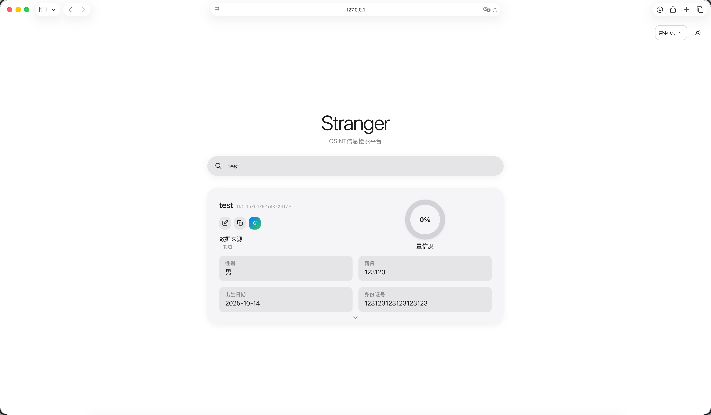
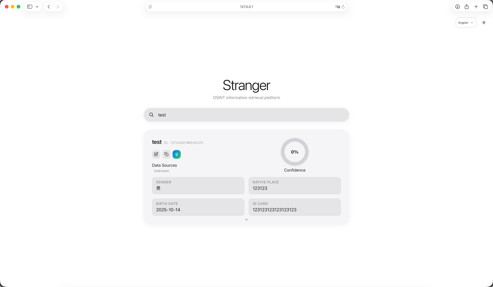

# Stranger
참고: 이 프로젝트는 전적으로 AI에 의해 작성되었습니다.

<p align="center">
  
  
</p>

프론트엔드와 백엔드를 통합한 OSINT 통합·검색 시스템입니다. 다국어 UI, 데이터 관리, 소스 상세 보기, 검증 쿼리, 선택적 AI 신뢰도 평가를 제공합니다.

## 주요 기능
- 스마트 검색: 질의 유형(이름/전화/이메일/QQ/신분증/웨이보 UID) 자동 판별, 페이지네이션/정렬/집계 지원.
- 다국어: 한국어, 중국어, 영어, 번체, 일본어. ARIA 지원 언어 메뉴.
- 데이터 관리: 추가/편집 모달, 소스 증분 업데이트, 레코드 삭제.
- 소스 상세: 결과의 소스 칩 클릭 시 상세 모달 표시.
- 검증: 전화 지역, QQ 프로필, Weibo UID 정보, 신분증 구조 파싱.
- AI 신뢰도: 평가 후 주 테이블에 선택적으로 반영.
- 헬스/메트릭: 모니터링용 통합 엔드포인트.
- 보안: CORS(`flask-cors`, `CORS_ORIGINS` 설정), 압축(`Flask-Compress`), 레이트 제한(`flask-limiter`, `RATE_LIMIT` 설정, 기본 `60 per minute`). 인증 활성화 시(`AUTH_ENABLED=true`) 비정적 라우트에서 로그인 필요.

## 아키텍처
- 프론트엔드: `static/` 모듈형 JS, 엔트리 `static/main.js`, 템플릿 `templates/index.html`.
- 백엔드: Flask 앱 `app/app.py`(`create_app()`), 라우트 `app/api/routes.py`, 응답 통일 `app/api/response.py`.
- 데이터베이스: PostgreSQL. 메인 테이블 `profile`, 시작 시 인덱스 생성. 크로스 테이블 스캔과 동적 별칭은 `app/models/database.py`.
- 설정: `config/config.py`로 일원화, 환경 변수 주입. CORS/압축/레이트 리밋 지원.

## 화면 및 UX
- PWA 지원: 데스크톱 설치, 오프라인 매니페스트 및 서비스 워커.
- 다크/라이트 테마 및 UI에서 언어 전환.
- 키보드 내비게이션 및 ARIA 레이블을 지원하는 접근성 컴포넌트.

## 스크린샷

<div align="center">



<br/>



</div>

## 아키텍처
- 프론트엔드: `static/` 모듈형 JS, 엔트리 `static/main.js`, 템플릿 `templates/index.html`.
- 백엔드: Flask 앱 `app/app.py`(`create_app()`), 라우트 `app/api/routes.py`, 응답 통일 `app/api/response.py`.
- 데이터베이스: PostgreSQL. 메인 테이블 `profile`, 시작 시 인덱스 생성. 크로스 테이블 스캔과 동적 별칭은 `app/models/database.py`.
- 설정: `config/config.py`로 일원화, 환경 변수 주입. CORS/압축/레이트 리밋 지원.
  - CORS: `flask-cors`로 활성화. `CORS_ORIGINS`로 허용 오리진 설정(기본 `*`).
  - 압축: `Flask-Compress`로 JSON/텍스트 응답 압축.
  - 레이트 제한: `flask-limiter`로 활성화. 기본 `RATE_LIMIT=60 per minute`.
  - 인증: `AUTH_ENABLED=true`인 경우 모든 비정적 라우트에서 로그인 필요.

## 데이터 소스
- `config/data_source.json`에서 친숙한 이름과 날짜 설정.
- 앱은 사용 가능할 때 DB 메타데이터에서 누락된 항목을 자동 동기화.
- 템플릿 예시:
  ```json
  {
    "example_table": { "name": "예시 데이터 소스", "date": "YYYY-MM-DD" }
  }
  ```

## 디렉터리
- `app/` 백엔드 (API/서비스/모델/초기화)
- `static/` 프론트 자산 (JS/CSS/아이콘)
- `templates/` Jinja 템플릿
- `config/` 설정 및 매니페스트
- `scripts/` 헬퍼 스크립트 (스모크 테스트, DB 검사)

## 빠른 시작
- 요구사항: Python 3.9+, PostgreSQL
- 의존성 설치: `pip3 install -r requirements.txt`
- 환경 설정: `.env.example`을 `.env`로 복사하고 설정:
  - `FLASK_HOST`, `FLASK_PORT`, `FLASK_ENV`, `CORS_ORIGINS`
  - `PG_HOST`, `PG_PORT`, `PG_DATABASE`, `PG_USER`, `PG_PASSWORD`
  - `SOURCE_DETAIL_STATEMENT_TIMEOUT_MS` (기본 `60000` ms)
  - 선택적 프록시 및 크롤러: `CRAWLER_TIMEOUT`, `CRAWLER_RETRIES`, `CRAWLER_BACKOFF`, `HTTP_PROXY`/`HTTPS_PROXY`
- 개발 실행: `python3 main.py` (기본 `http://127.0.0.1:8080`)
- 프로덕션 실행: `gunicorn -w 4 -b 0.0.0.0:5082 app.app:app` (기본 `http://127.0.0.1:5082`)

## 접근
- 개발: `http://127.0.0.1:8080/` (`python3 main.py` 경유)
- 프로덕션/Docker: `http://127.0.0.1:5082/`
- 헬스: `/health`
- 메트릭: `/api/metrics`

## API 개요
- `GET /api/search`: 매개변수 `query`; 선택적 `page`, `page_size`, `sort`, `order`, `expand`
- `POST /api/customer`: 레코드 생성
- `PUT /api/customer/<id>`: 허용된 필드 업데이트
- `DELETE /api/customer/<id>`: 레코드 삭제
- `GET /api/source_detail`: 주체 키(`id_card`, `phones`, `qqs`, `weibo_uid`, `email`, `name`)로 테이블 히트 세부 정보 검사
- 검증기:
  - `GET /api/validate/phone` — 매개변수: `number`(필수), `write`(`1|true|yes`로 지속), 선택적 `id_card`, `merge_phone`; 귀속 정보(`province`, `city`, `carrier`, `area_code`, `postcode`)와 `updated`/`id` 반환.
  - `GET /api/validate/qq` — 매개변수: `qq`(필수), `write`(`1|true|yes`), 선택적 `id_card`, `merge_phone`; `name`, `logo`, `updated`/`id` 반환.
  - `GET /api/validate/weibo` — 매개변수: `uid` 또는 `weibo_uid`(필수), `write`(`1|true|yes`), 선택적 `id_card`; 프로필 요약(`name`, `gender`, `avatar`, `fans`, `follows`, `rpz`, `posts`)과 `updated`/`id` 반환.
  - `GET /api/validate/id_card` — 매개변수: `id_card`(필수), `write`(`1|true|yes`); 파싱된 필드(`birth_date`, `gender`, `native_place`, `valid`)와 기존과의 일관성 반환.
- AI: `POST /api/ai/assess_confidence`
- 내성: `GET /api/schema_introspect`
- 헬스 및 메트릭: `GET /health`, `GET /api/metrics`

> 참고: 대규모 또는 개인정보 민감한 쿼리의 경우, `/api/search`와 `/api/source_detail`은 선택적으로 `POST` JSON 본문을 지원(듀얼 스택 설계).

## 배포 예시
**Gunicorn (포그라운드 테스트)**
- `pip3 install gunicorn`
- `gunicorn -w 4 -b 127.0.0.1:5082 app.app:app`

**Nginx 리버스 프록시**
```
upstream stranger_app {
    server 127.0.0.1:5082;
}

server {
    listen 80;
    server_name your.domain.com;

    location / {
        proxy_pass http://stranger_app;
        proxy_set_header Host $host;
        proxy_set_header X-Real-IP $remote_addr;
        proxy_set_header X-Forwarded-For $proxy_add_x_forwarded_for;
        proxy_set_header X-Forwarded-Proto $scheme;
        proxy_read_timeout 75s;
        proxy_send_timeout 75s;
    }

    location /static/ {
        proxy_pass http://stranger_app;
    }
}
```

**systemd 서비스**
- 환경 파일: `/etc/stranger/stranger.env` (`.env.example` 참조)
- 유닛: `/etc/systemd/system/stranger.service`
```
[Unit]
Description=Stranger API Service
After=network.target

[Service]
Type=simple
WorkingDirectory=/opt/stranger
EnvironmentFile=/etc/stranger/stranger.env
ExecStart=/usr/bin/gunicorn -w 4 -b 0.0.0.0:${FLASK_PORT} app.app:app
Restart=always
RestartSec=5

[Install]
WantedBy=multi-user.target
```

## Docker
프로덕션 이미지 빌드 (Python 3.12-slim + Gunicorn):

**빌드**
- `docker build -t stranger:latest .`

**실행** (컨테이너 5082를 호스트 5082에 매핑)
- `docker run --name stranger -p 5082:5082 --env FLASK_PORT=5082 stranger:latest`

**참고**
- 기본 명령: `gunicorn -w 4 -b 0.0.0.0:5082 app.app:app`.
- `-p <host_port>:<container_port>`와 `FLASK_PORT`로 호스트 포트 변경.
- `.dockerignore`로 이미지 크기 축소.

## 보안 주의사항
- `.env`를 커밋하지 마세요; 시크릿(DB, API 키)은 환경을 통해 주입됩니다.
- 이전에 공유된 경우 자격 증명을 로테이트하세요; 플레이스홀더에는 `.env.example`을 사용하세요.
- 엔드포인트 노출 전에 `CORS_ORIGINS`와 `RATE_LIMIT`를 검토하세요.
- `AUTH_ENABLED=true`인 경우 `AUTH_USERNAME`과 `AUTH_PASSWORD`(또는 `AUTH_PASSWORD_HASH`)를 구성하세요.

## Docker Compose
원 커맨드 빌드 및 실행을 위해 `docker-compose.yml` 사용.

- 시작: `docker compose up -d --build`
- 로그: `docker compose logs -f stranger`
- 중지: `docker compose down`

참고:
- `FLASK_PORT`(기본 `5082`)에서 호스트 포트; 컨테이너 `5082`에 매핑.
- Compose는 `.env`를 자동으로 읽음; Gunicorn은 컨테이너 내에서 `app.app:app`을 실행.

## 성능 및 안정성 팁
- 전화 매칭에는 인덱스 친화적인 등가 조건을 선호; 전체 스캔 회피.
- `SOURCE_DETAIL_STATEMENT_TIMEOUT_MS` 조정; 일반 열에 대한 표현식 인덱스 유지.
- 크로스 테이블 스캔 예산 제어: `SCAN_MAX_TABLES`, `SCAN_LIMIT_PER_TABLE`, `SCAN_TOTAL_TIME_BUDGET_MS`.
- 연결 관리: 풀(`ThreadedConnectionPool`) 또는 요청 범위 연결 고려.
- 레이트 제한 저장소: 다중 복제본 배포에는 공유 저장소(예: Redis) 사용.
- 로깅 및 관찰 가능성: 구조화된 로그, 로테이션, 적절한 레벨.

## 스모크 테스트
- `python3 scripts/smoke_test.py` 또는 `python3 scripts/smoke_test.py http://<host>:<port>`
- 커버: `/`, `/api/metrics`, `/api/search`, `/api/source_detail`, `/api/schema_introspect`, `/api/validate/id_card`
- 예상: `PASS (6 passed, 0 failed)`

## 문제 해결
- 503 / 타임아웃: `statement timeout` 로그 확인; 타임아웃 증가 또는 쿼리 최적화; 인덱스 확인.
- 느린 크로스 테이블 스캔: 예산을 낮추거나 키 기반 집계로 전환.
- 외부 요청 실패: 프록시 및 재시도 구성 설정; 아웃바운드 네트워크 정책 확인.

## 기여 및 라이선스
- 이슈와 PR 환영; 제출 전에 스모크 테스트를 실행하고 문서를 업데이트하세요.
- `LICENSE`의 조건에 따라 라이선스됨.

## 보안 주의사항
- 프로덕션에서는 `SECRET_KEY`, `PG_PASSWORD`, `AUTH_PASSWORD`를 변경하세요.
- `CORS_ORIGINS`를 신뢰할 수 있는 도메인으로 제한하세요 (기본 `*`).
- `RATE_LIMIT`를 적절히 설정하세요 (기본 `60 per minute`).

## 배포 예시
- Gunicorn(포그라운드): `gunicorn -w 4 -b 127.0.0.1:5082 app.app:app`
- Nginx 리버스 프록시 및 systemd 예시는 영문 README 참고.

## Docker
- 빌드: `docker build -t stranger:latest .`
- 실행: `docker run --name stranger -p 5082:5082 --env FLASK_PORT=5082 stranger:latest`

## Docker Compose
- 시작: `docker compose up -d --build`
- 로그: `docker compose logs -f stranger`
- 중지: `docker compose down`

## 성능 및 안정성 팁
- 인덱스 친화적인 등가 조건을 우선 사용, 전체 스캔 회피.
- 크로스 테이블 스캔 예산 제어. 일반 열에 대한 표현식 인덱스 유지.

## 스모크 테스트
- `python3 scripts/smoke_test.py` 또는 베이스 URL 지정 (기본 `http://127.0.0.1:5082`).
- 6개 엔드포인트 테스트: `/`, `/api/metrics`, `/api/search`, `/api/source_detail`, `/api/schema_introspect`, `/api/validate/id_card`.

## 기여 및 라이선스
- Issue/PR 환영. 스모크 테스트 실행과 문서 갱신을 권장합니다.